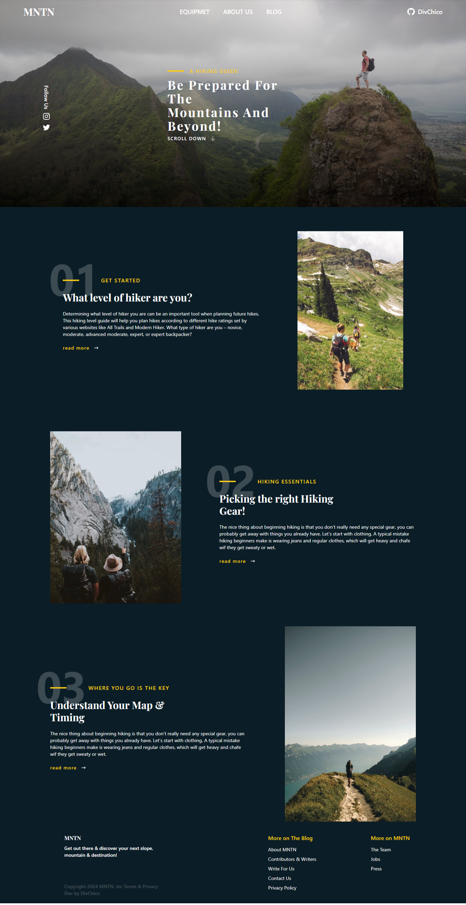

<h1 align="center" style="font-weight: bold;">Mntn- landing page 💻</h1>

<a href="#tech">Technologies</a>

landing page for hiking blog

<a href="https://mntn-landing-page.onrender.com">📱 Visit this Project</a>

 
<h2 id="layout">🎨 Layout</h2>

 
<h2 id="technologies">💻 Technologies</h2>

- react
- vite
- tailwindcss
- framer motion

<h2 id="started">🚀 Getting started</h2>

npm i ,
npm run dev

<h3>Documentations that might help</h3>

[📝 How to create a Pull Request](https://www.atlassian.com/br/git/tutorials/making-a-pull-request)

[💾 Commit pattern](https://gist.github.com/joshbuchea/6f47e86d2510bce28f8e7f42ae84c716)
